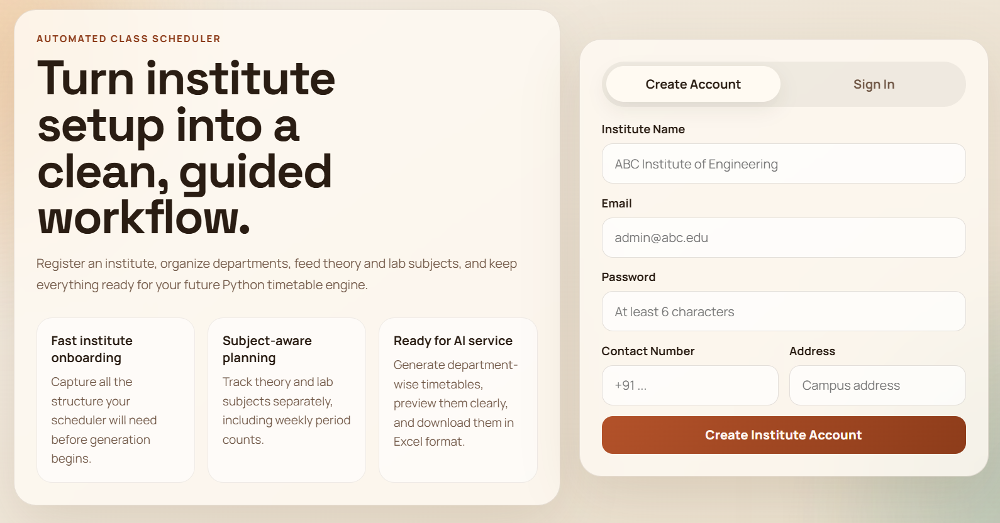
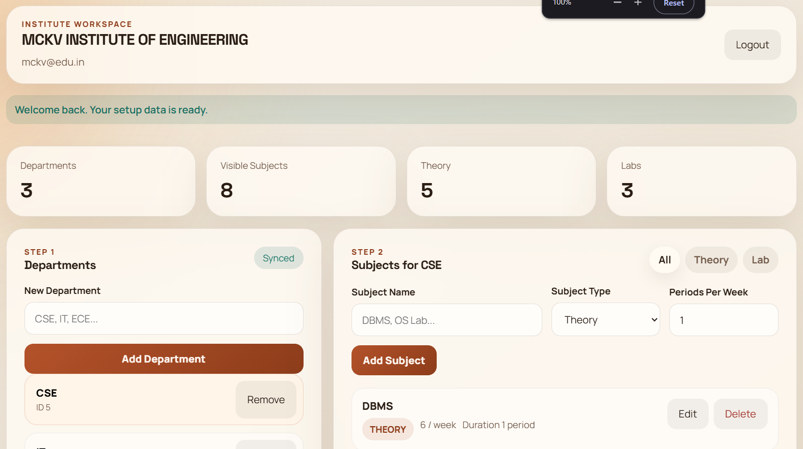
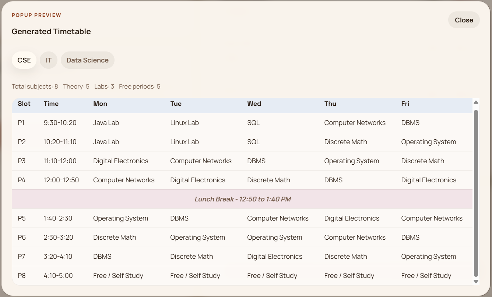

# Automated Class Scheduler

Automated Class Scheduler is a full-stack project for institute onboarding, department and subject management, and AI-assisted timetable generation.

The project is split into three parts:

- `college-scheduler` - Java Spring Boot backend
- `AI service/Time table generator` - Python FastAPI timetable generator
- `frontend` - React frontend

## Project Structure

```text
Automated Class Schedular/
├── college-scheduler/
├── AI service/
│   ├── Time table generator/
│   └── requirements.txt
└── frontend/
```

## Features

- institute registration and login
- department management
- subject management for theory and lab classes
- timetable generation with fixed day and lunch constraints
- timetable preview in the web app
- timetable download in `.xlsx` format

## Screenshots

### Login Page



### Dashboard Overview



### Generated Timetable Preview



## Tech Stack

### Backend

- Java 21
- Spring Boot
- Spring Security
- Spring Data JPA
- MySQL
- JWT authentication

### AI Timetable Generator

- Python 3.11+
- FastAPI
- Uvicorn
- OpenPyXL

### Frontend

- React
- Vite

## Prerequisites

Before starting, make sure you have:

- Java 21
- Maven or Maven Wrapper support
- MySQL running locally
- Python 3.11 or later
- Node.js and npm

## 1. Spring Boot Backend Setup

Backend folder:

```bash
college-scheduler
```

### Configuration

The backend currently uses the settings in:

- [application.properties](/d:/Automated%20Class%20Schedular/college-scheduler/src/main/resources/application.properties)

Default values include:

- port: `8080`
- database: `class_scheduler`
- MySQL username: `root`

Update the database username, password, JWT secret, and any environment-specific values before production use.

### Run the Backend

From the `college-scheduler` folder:

```bash
./mvnw spring-boot:run
```

On Windows PowerShell, if needed:

```powershell
.\mvnw.cmd spring-boot:run
```

### Backend API

Once running:

- Swagger UI: `http://localhost:8080/swagger-ui.html`
- API base: `http://localhost:8080`

## 2. Python AI Timetable Generator Setup

AI service folder:

```bash
AI service
```

### Install Dependencies

From the `AI service` folder:

```bash
pip install -r requirements.txt
```

### Run the AI Service

Go to the timetable generator folder:

```powershell
cd "AI service\Time table generator"
```

Then start the FastAPI app:

```bash
python -m uvicorn app:app --reload --port 8000
```

### AI Service API

Once running:

- Health check: `http://localhost:8000/health`
- Swagger docs: `http://localhost:8000/docs`

### Timetable Rules

The generator currently follows these rules:

- 5 working days: Monday to Friday
- 8 periods per day
- fixed lunch break between `12:50 PM` and `1:40 PM`
- lab subjects occupy 2 consecutive periods
- lab blocks cannot cross lunch
- unused slots are marked as `Free / Self Study`

## 3. React Frontend Setup

Frontend folder:

```bash
frontend
```

### Install Dependencies

From the `frontend` folder:

```bash
npm install
```

### Optional Environment Variables

Create a `.env` file inside `frontend` if you want to override defaults:

```bash
VITE_API_BASE_URL=http://localhost:8080
VITE_AI_API_BASE_URL=http://localhost:8000
```

### Run the Frontend

From the `frontend` folder:

```bash
npm run dev
```

The frontend will usually start on:

- `http://localhost:5173`

## Full Local Run Order

Start the services in this order:

1. Start MySQL
2. Start the Spring Boot backend on port `8080`
3. Start the Python AI timetable generator on port `8000`
4. Start the React frontend on port `5173`

## How the System Works

1. An institute registers or logs in from the frontend.
2. The frontend stores department and subject data through the Spring Boot backend.
3. When the user clicks timetable generation, the frontend collects the department and subject data and sends it to the Python AI service.
4. The AI service generates the timetable, returns a preview, and creates an Excel file.
5. The frontend displays the preview and provides the Excel download link.

## Notes

- The frontend currently starts each fresh browser session in a logged-out state.
- The timetable generator validates the input strictly. For example, lab periods should be even because labs are scheduled in 2 consecutive slots.
- The backend still deserves additional authorization hardening before production use.

## Useful Paths

- [Backend](/d:/Automated%20Class%20Schedular/college-scheduler)
- [AI Service](/d:/Automated%20Class%20Schedular/AI%20service/Time%20table%20generator)
- [Frontend](/d:/Automated%20Class%20Schedular/frontend)
